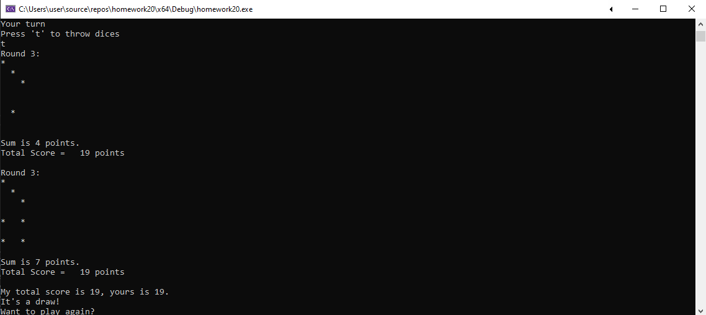

# GAME OF DICE

This console application imitates a game with a Computer (Random) on throwing dice. The game consists of three rounds, each player has a set of 2 dice. 
A player who has bigger number in total is the winner.

Screens:  

